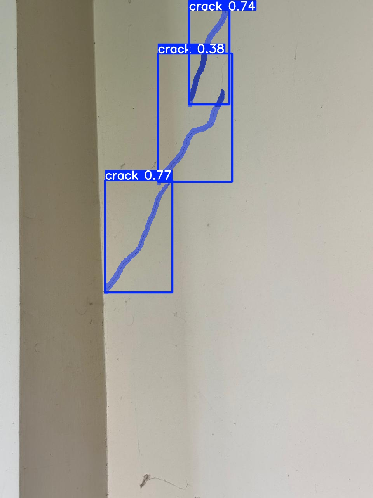
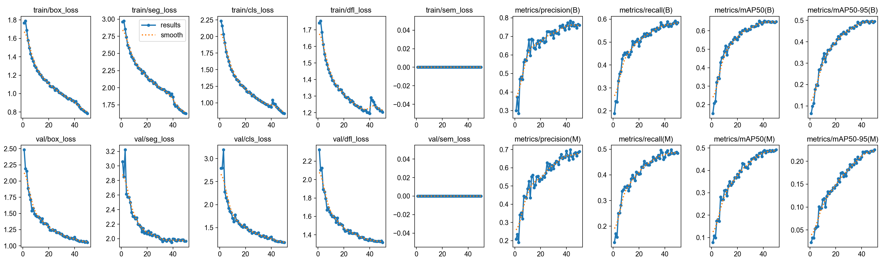
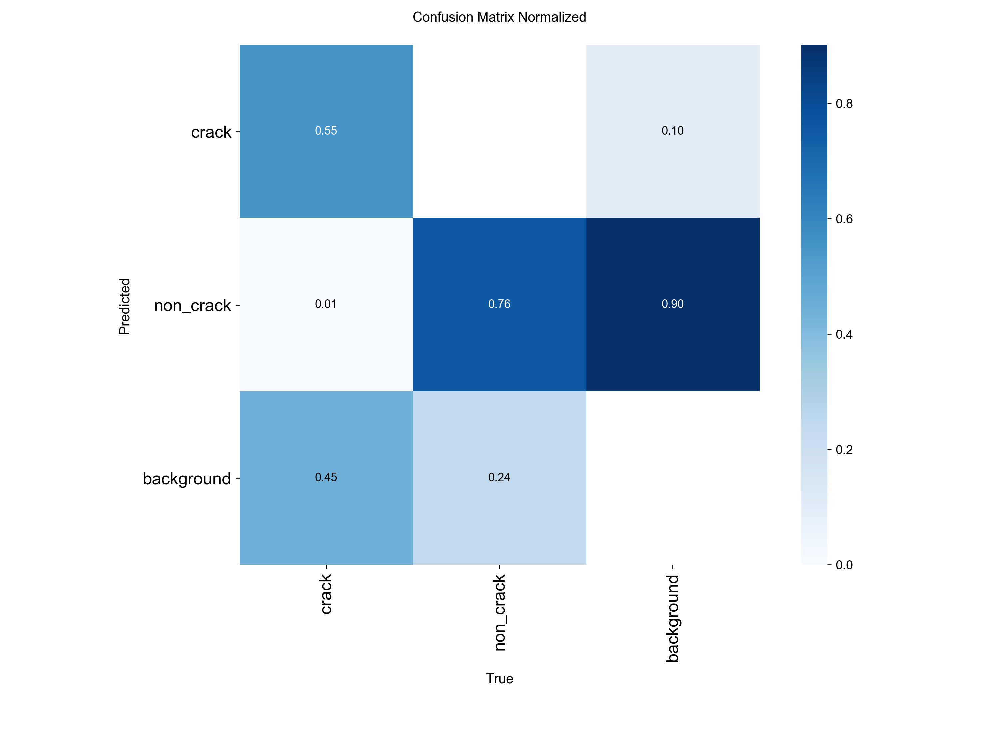

# Automated Concrete Crack Detection and Instance Segmentation Using YOLO11

An end-to-end computer vision project for locating concrete cracks and producing
pixel-level instance masks with Ultralytics YOLO11. The repository contains
reproducible training, evaluation, and inference scripts together with selected
results from a 50-epoch YOLO11l-seg experiment.



## Features

- Detects concrete cracks in images and videos.
- Produces bounding boxes and instance segmentation masks.
- Supports training, validation, test evaluation, and inference.
- Uses a portable dataset configuration with no machine-specific paths.
- Keeps datasets, generated runs, and large checkpoints out of Git history.

## Dataset

This project uses the
[Concrete Crack Segmentation Dataset](https://datasetninja.com/concrete-crack-segmentation-dataset).
The published dataset contains 458 high-resolution images, 1,010 annotated crack
instances, and one annotation class (`crack`). It is distributed under the
[CC BY 4.0 license](https://creativecommons.org/licenses/by/4.0/).

Original dataset citation:

> Özgenel, Çağlar Fırat (2019), "Concrete Crack Segmentation Dataset",
> Mendeley Data, V1. https://doi.org/10.17632/jwsn7tfbrp.1

Dataset Ninja provides a Supervisely-format download. Before training with
Ultralytics, convert the polygon annotations to YOLO segmentation format and
create a train/validation/test split because the source dataset does not define
one.

Expected local layout:

```text
datasets/concrete-crack-segmentation/
├── images/
│   ├── train/
│   ├── val/
│   └── test/
└── labels/
    ├── train/
    ├── val/
    └── test/
```

Each image must have a matching `.txt` label. A YOLO segmentation row starts
with the class index followed by normalized polygon coordinates:

```text
0 x1 y1 x2 y2 x3 y3 ...
```

Review [configs/data.yaml](configs/data.yaml) if your dataset is stored
elsewhere or does not include a test split.

## Repository Structure

```text
.
├── .github/workflows/       # Lightweight GitHub Actions checks
├── configs/data.yaml        # Portable YOLO dataset configuration
├── datasets/                # Local dataset directory (Git-ignored)
├── docs/assets/             # Curated result figures used by this README
├── src/
│   ├── train.py             # Model training
│   ├── evaluate.py          # Validation and test evaluation
│   └── predict.py           # Image, directory, and video inference
├── weights/                 # Local checkpoints (Git-ignored)
├── .gitignore
├── README.md
└── requirements.txt
```

## Installation

Python 3.10 or newer is recommended.

```bash
git clone <your-repository-url>
cd <your-repository-name>

python -m venv .venv
```

Activate the environment:

```bash
# Windows PowerShell
.\.venv\Scripts\Activate.ps1

# Linux or macOS
source .venv/bin/activate
```

Install dependencies:

```bash
python -m pip install --upgrade pip
pip install -r requirements.txt
```

For GPU training, install the PyTorch build appropriate for your CUDA version
before installing the remaining requirements.

## Training

The defaults reproduce the main experiment configuration: YOLO11l-seg,
50 epochs, batch size 8, and 640-pixel input images.

```bash
python src/train.py
```

Customize training:

```bash
python src/train.py \
  --model yolo11l-seg.pt \
  --data configs/data.yaml \
  --epochs 50 \
  --batch 8 \
  --imgsz 640 \
  --device 0
```

Ultralytics downloads the base checkpoint automatically when it is not already
available. Training outputs are written under `runs/segment/`.

## Evaluation

```bash
python src/evaluate.py \
  --weights runs/segment/yolo11l_concrete_cracks/weights/best.pt \
  --split val \
  --device 0
```

Use `--split test` only when `images/test` and `labels/test` exist.

## Inference

Run inference on an image:

```bash
python src/predict.py \
  --weights runs/segment/yolo11l_concrete_cracks/weights/best.pt \
  --source path/to/concrete.jpg
```

Run inference on a video:

```bash
python src/predict.py \
  --weights weights/best.pt \
  --source path/to/video.mp4 \
  --conf 0.25
```

Results are saved under `runs/segment/predict/`. The source can also be a
directory, URL, or webcam index such as `0`.

## Experiment Results

The retained local experiment used `yolo11l-seg.pt` for 50 epochs with an image
size of 640 and batch size 8. Its historical checkpoint contains two model
labels, `crack` and `non_crack`; the public dataset configuration uses only the
annotated `crack` class from the linked dataset.

Final epoch metrics:

| Task | Precision | Recall | mAP50 | mAP50-95 |
|---|---:|---:|---:|---:|
| Bounding boxes | 0.761 | 0.586 | 0.650 | 0.495 |
| Segmentation masks | 0.689 | 0.484 | 0.492 | 0.225 |

These values describe the original local split and should not be treated as a
benchmark on a standardized test set.





## Model Weights

PyTorch checkpoints are excluded from Git by default to keep the repository
small. Publish the selected `best.pt` checkpoint as a GitHub Release asset and
document its download URL here. Do not commit every training checkpoint.

## Limitations

- Performance depends strongly on lighting, concrete texture, camera distance,
  crack width, and annotation quality.
- The source dataset has no official split, so metrics vary with the chosen
  train/validation/test partition.
- Thin or low-contrast cracks may be missed at 640-pixel input resolution.
- Predictions should support, not replace, inspection by qualified structural
  engineering professionals.

## Reproducibility

The training script uses a fixed random seed of `0`. Exact results may still
vary by GPU, CUDA, PyTorch, Ultralytics version, dataset conversion, and split.
Record these details when publishing new results.

## Acknowledgements

- [Ultralytics YOLO](https://github.com/ultralytics/ultralytics)
- [Concrete Crack Segmentation Dataset on Dataset Ninja](https://datasetninja.com/concrete-crack-segmentation-dataset)
- Dataset author: Çağlar Fırat Özgenel

## License

No software license has been selected for this repository yet. Add a `LICENSE`
file before publishing if you want others to be able to reuse or modify the
code. The dataset has its own CC BY 4.0 license and attribution requirements.
